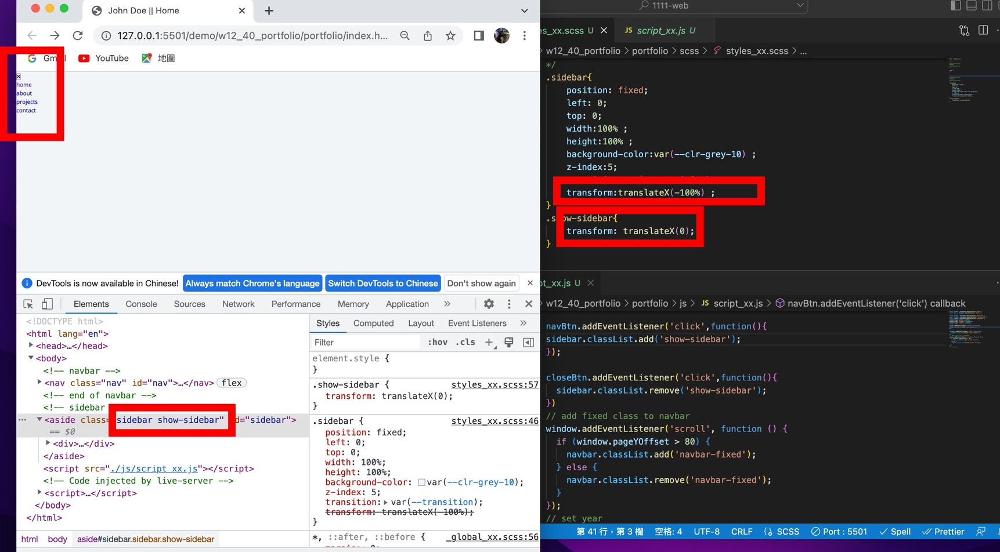
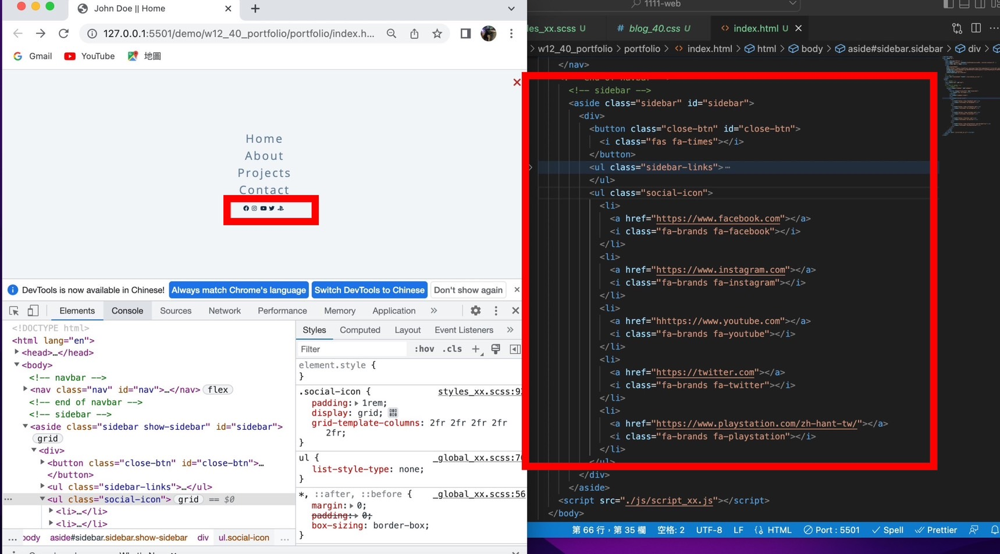
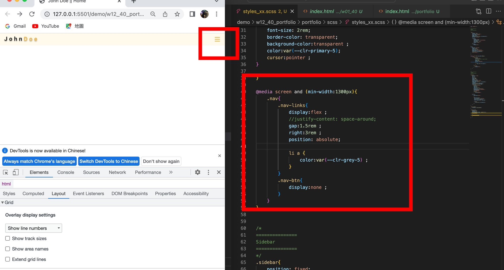
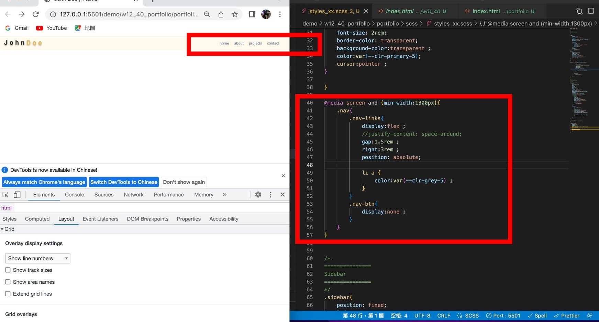
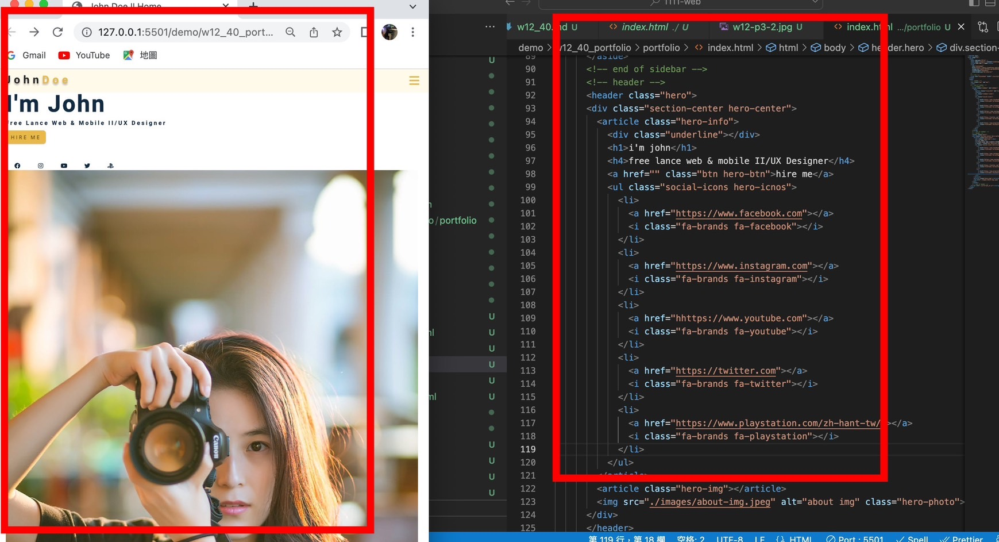

### W12-P1: click nav-btn, add show-sidebar; click close-btn, remove show-sidebar

### w12-p2: finish sidebar with social icons

### w12-p3:判斷螢幕大小,顯示正確的nav

### w12-p4:完成 hero html

### w12-p5: all log
